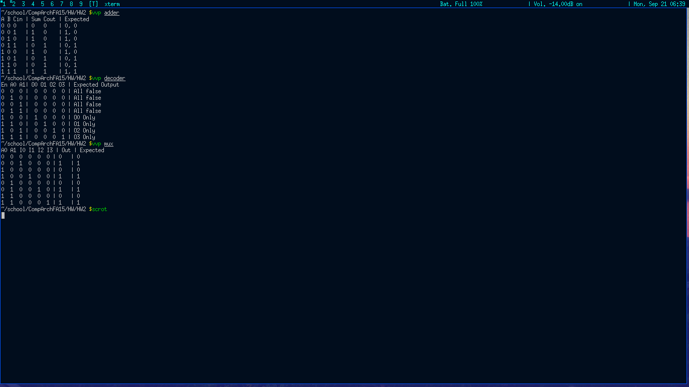
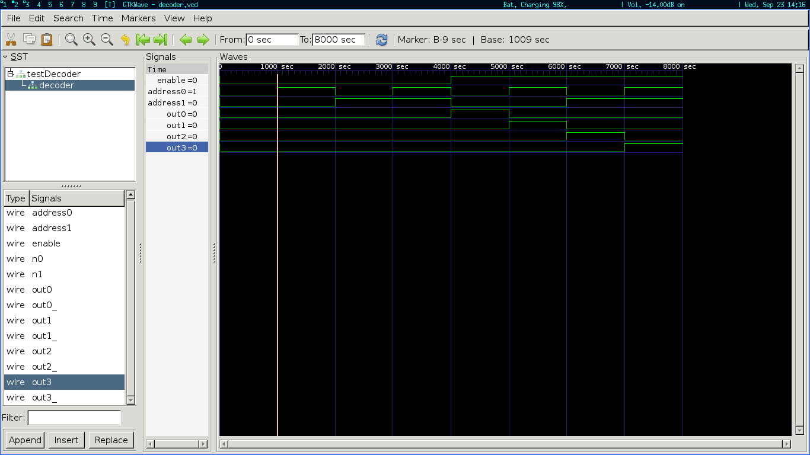
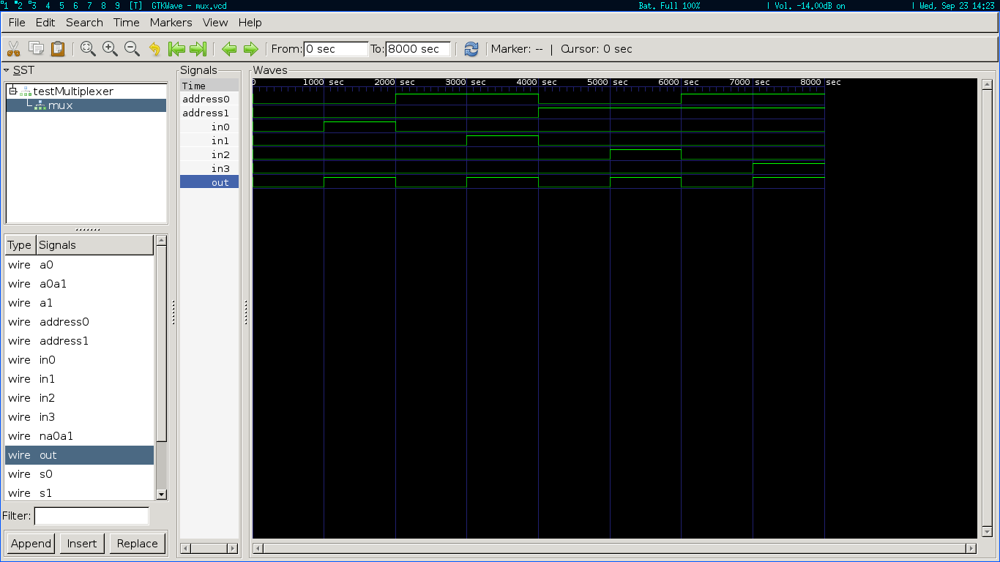
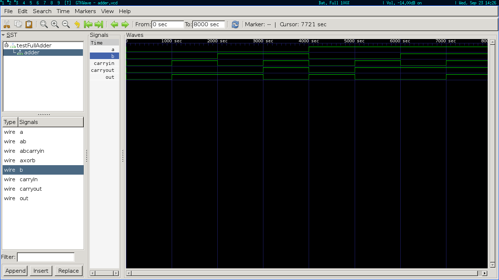

Structural implementations meet expected values; though not pictured below expected values match behavioral implementations.

Waveform graph of 2 bit decoder

Waveform graph of 2 bit mux

Waveform graph of full adder

